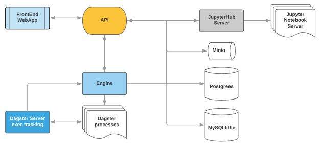

# The easier way to do machine learning with Python without coding!

Let's take a look at our high level architecture

While developing our platform, we will like to used a Microservices architecture, for now as you can find in the different folders (apiMiddl, frontEnd, engine) we have made 3 and we are using JypyterHub and Minio services too. 

##Front-End

We call as Front-End the service which is responsible of running de Web application it is based on Veue.js framework, HTML and CSS, Vuetify and Bootstrap for style side. The most complext part of the Front-End the Machine Learning Studio uses following technologies JsPlumb, JQuery, JQurey-UI and Html2pdf for Javascript side. JsPlumb controls the machine learning nodes connection. JQurey-UI library control drag and drop the nodes. JQuery makes an easy and short Javascript code. Html2pdf for generating a pdf file. Vuetify and Bootstrap provide a beautiful element's style like the inputs, buttons and even animations.

##apiMiddl

Our main service which orchestrates all communications between the Front-End and the rest of services is called API which has main responsibility of handling, security implementing OAuth authentication method for communicating with JupyterHub-Server, user management using SQLlittle as a storage, and acting as a proxy for Engine service, JupyterHub-Server and MINIO object storage. This service is based on Django.

##Engine

The core of the machine learning studio build using Flask. Our Engine service is where each one of the droppable functionalities are implemented and the one responsible of running.

## Contribute 

We are open source and we ❤️ contributions big or small. [See our guide](https://github.com/elmpystudio/eps/blob/main/README.md) on how to get started.

## Get in touch 

We are working in our social networks and website, our commintment is focused on the code just [check our commintment statement](https://github.com/elmpystudio/eps/blob/main/COMMINTMENT.md).
For now you can contact directly to egomiciamur@elm.sa and if you want to know more about us [Check our division website](https://elm.sa/en/research-and-innovation/Pages/overview.aspx) 

